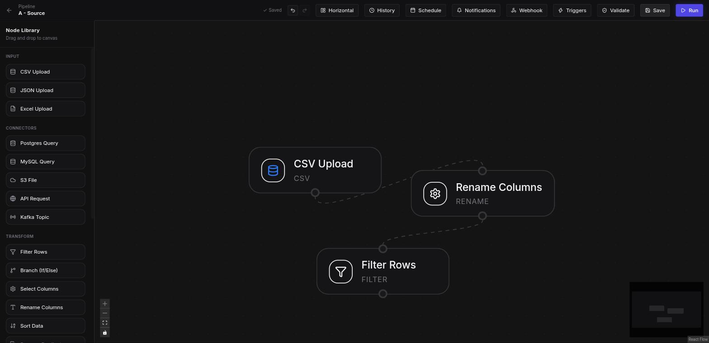
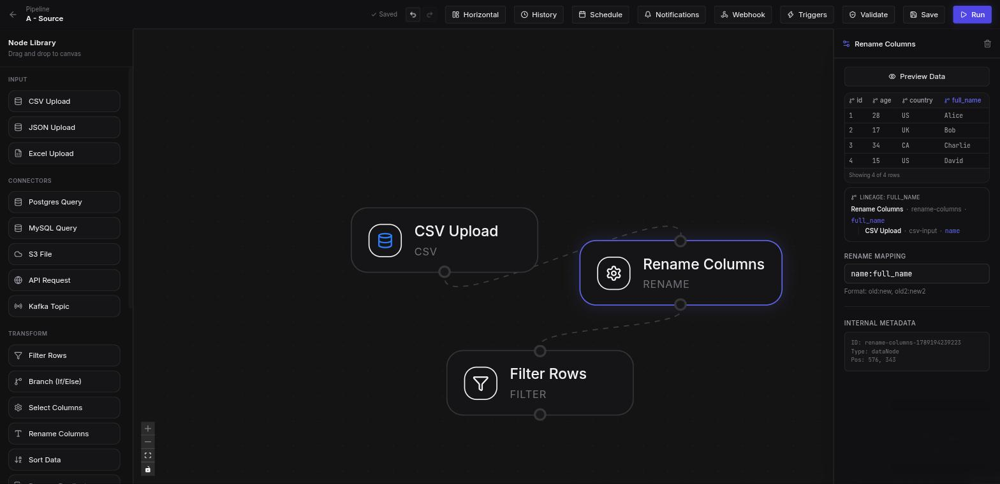
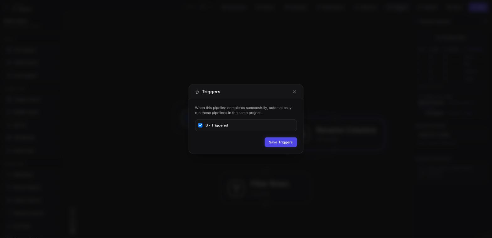
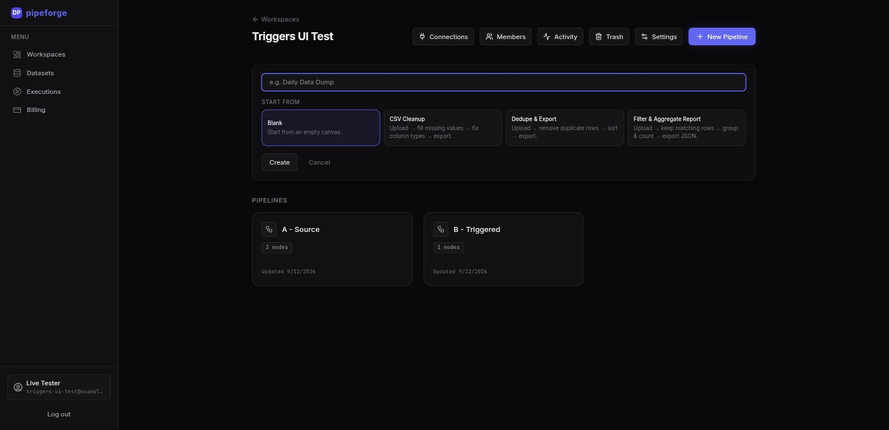
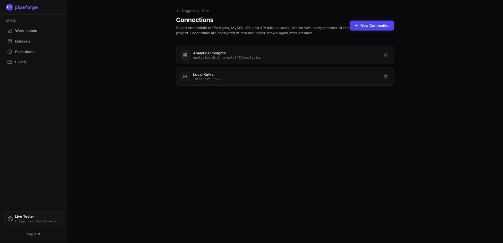
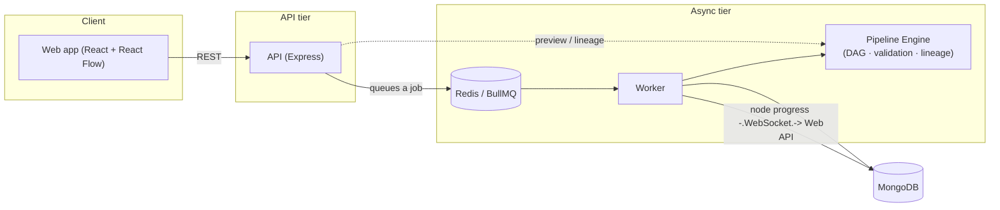

<div align="center">

# PipeForge

**Build data pipelines visually.**

Drag, drop, and connect nodes to design ETL pipelines — no code required to run them, full code-level control when you need it.

[](./LICENSE)
[](https://github.com/varuns2903/pipeforge/actions/workflows/ci.yml)
[](.github/workflows/ci.yml)
[](tsconfig.json)

[Features](#features) · [Screenshots](#screenshots) · [Quick start](#quick-start) · [Architecture](#architecture) · [Docs](#documentation)

</div>

---

PipeForge represents a pipeline as a directed acyclic graph (DAG) of nodes — read from a CSV, database, API, or Kafka topic; filter, join, aggregate, and reshape; write out to a file or another connector. It runs your pipelines asynchronously with live progress, keeps a full execution history, and lets a team collaborate on the same project with role-based access.

<p align="center">
  
</p>

## Features

**Editor**
- Visual, drag-and-drop DAG editor (React Flow) with live validation and per-node error/warning badges
- Undo/redo across every canvas action
- Starter templates (CSV Cleanup, Dedupe & Export, Filter & Aggregate Report) or start from a blank canvas
- Inline data preview — run just one node's upstream slice and see real output before saving
- Column-level lineage — click a column in the preview to trace it back through renames, joins, and aggregates to its source
- Column-name autocomplete in config fields, learned from the pipeline's last run

**Connectors & node types**
- Input: CSV (custom delimiter), JSON, Excel
- Connectors: Postgres, MySQL, S3, generic REST API, Kafka — credentials saved once, encrypted, shared across a project
- Transform: filter, branch (if/else), select/rename columns, sort, deduplicate, fill nulls, cast type, join, union
- Aggregate: group & aggregate, window functions (row_number / rank / dense_rank)
- Output: CSV, JSON, Excel

**Execution**
- Asynchronous execution engine (BullMQ + Redis) with real-time per-node progress over WebSockets
- Scheduled (cron) runs, one-click retry, and immutable per-execution snapshots for versioning
- Pipeline-to-pipeline triggering — chain pipelines to fire on completion, with built-in cycle protection
- Per-user execution/storage quotas and a hard dataset-size cap so one bad pipeline can't take down the worker

**Collaboration & platform**
- Project-based roles (owner / editor / viewer), shared connections and files, per-project activity log
- Email + webhook notifications on completion/failure; Prometheus alerts to Slack or email
- Prometheus metrics, OpenTelemetry tracing with trace-correlated logs, and a pre-provisioned Grafana dashboard
- Stripe-backed plan tiers, OpenAPI docs, rate limiting, and a full Playwright E2E suite

See [CHANGELOG.md](./CHANGELOG.md) for the complete, dated history of how this came together.

## Screenshots

<table>
<tr>
<td width="50%">

<p align="center"><sub>Inline preview with column-level lineage</sub></p>
</td>
<td width="50%">

<p align="center"><sub>Pipeline-to-pipeline triggers</sub></p>
</td>
</tr>
<tr>
<td width="50%">

<p align="center"><sub>Starter templates</sub></p>
</td>
<td width="50%">

<p align="center"><sub>Saved, encrypted connections</sub></p>
</td>
</tr>
</table>

## Quick start

Run the whole stack (web, API, worker, MongoDB, Redis) with Docker:

```bash
git clone https://github.com/varuns2903/pipeforge.git
cd pipeforge
cp .env.example .env   # fill in JWT_SECRET and CONNECTION_ENCRYPTION_KEY — required, no defaults
docker compose -f docker-compose.prod.yml up -d --build
```

Or run it locally for development:

```bash
npm install
docker compose up -d              # MongoDB + Redis only

npm run dev -w @pipeforge/api      # terminal 1
npm run dev -w @pipeforge/worker   # terminal 2
npm run dev -w @pipeforge/web      # terminal 3 — http://localhost:5173
```

## Architecture



The pipeline engine (`packages/pipeline-engine`) has no HTTP or queue dependency — it's shared by the API (for in-editor preview, lineage, and validation) and the worker (for real executions), so "what will this pipeline do" and "what did this pipeline do" always agree.

Full write-up, domain models, and directory layout: **[ARCHITECTURE.md](./ARCHITECTURE.md)**.

## Tech stack

| Layer | Stack |
|---|---|
| Frontend | React, TypeScript, Vite, React Flow, TanStack Query, Zustand, Tailwind CSS |
| API | Node.js, TypeScript, Express, Socket.IO, Zod, Stripe |
| Database | MongoDB (Mongoose) |
| Queue / worker | Redis, BullMQ |
| Observability | Prometheus, OpenTelemetry, Grafana, Alertmanager |
| Infra | Docker, Docker Compose, GitHub Actions |

## Documentation

| | |
|---|---|
| [ARCHITECTURE.md](./ARCHITECTURE.md) | Components, domain models, directory layout |
| [CONTRIBUTING.md](./CONTRIBUTING.md) | Git workflow, coding principles, definition of done |
| [CHANGELOG.md](./CHANGELOG.md) | Full, dated feature history |
| `/api/docs` | Interactive OpenAPI/Swagger UI, served by the running API |

## Testing

```bash
npm run test -w @pipeforge/api               # unit/integration — needs MongoDB/Redis (docker-compose.yml)
npm run test -w @pipeforge/pipeline-engine    # pure unit tests, no external services
npm run test -w @pipeforge/worker
npm run test:e2e                              # Playwright, against the full stack already running
```

CI (`.github/workflows/ci.yml`) runs all of the above, plus a Docker build check, on every push and PR.

## Deployment

Each app has a production Dockerfile, built from the repo root so it can pull in the `packages/*` workspaces it depends on:

```bash
docker build -f apps/api/Dockerfile -t pipeforge-api .
docker build -f apps/worker/Dockerfile -t pipeforge-worker .
docker build -f apps/web/Dockerfile --build-arg VITE_API_URL=https://api.example.com -t pipeforge-web .
```

Required environment variables are documented in `.env.example` (API/worker) and `apps/web/.env.example` (frontend). `JWT_SECRET` and `CONNECTION_ENCRYPTION_KEY` have no defaults and the API refuses to start without them. To run the full stack from a prebuilt image in one command, see [Quick start](#quick-start) above.

## Contributing

Contributions are welcome — please read [CONTRIBUTING.md](./CONTRIBUTING.md) first for the git workflow and coding principles this repo follows.

## License

[MIT](./LICENSE) © Varun S
